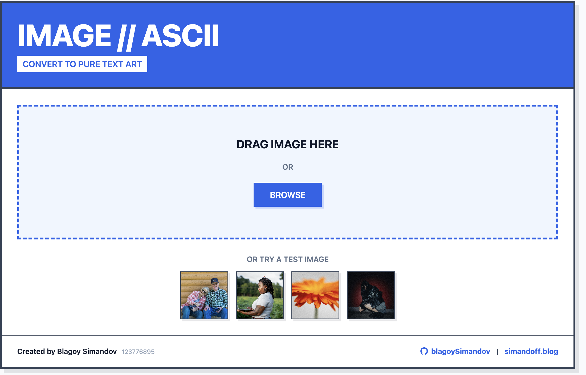

# Introduction to the web application

The web application is a simple image to ASCII-ART converter.

    
    

Zooming in on the web preview will allow you to see the individual characters of the image.

## How does it work ?

It takes an image and converts it to ASCII-ART by going through each individual pixel
getting it's RGB value (255,255,255) and first converting it to a grayscale value between 0.255
by just taking the weighted average of the RGB values
Why do we use a "weighted average" instead of just taking the average of the RGB values?
Human eyes are more sensitive to green than red or blue.
This is called the Luminosity method and for more info: https://www.johndcook.com/blog/2009/08/24/algorithms-convert-color-grayscale/

Than we use a hardcoded array with the ASCII-ART characters ordered by their "thickness" (the thicker it is the "whiter" the character will appear) and for each gray scale value we find the corrensponding character index by normalizing the 0.255 value to the range of the array.

`var Chars = strings.Split("`^\",:;Il!i~+\_-?][}{1)(|\\/tfjrxnuvczXYUJCLQ0OZmwqpdbkhao\*#MW&8%B@$", "")`

## The tech used

This is a golang web application with a static serve of index.html
It follows the conventianal golang project structure with cmd/ folder holding all the executables
and the internal/ folder holding all the packages that are not part of the public API.
Since the project is small we do not need any of the other conventional folders such as pkg/, vendor/ etc.

# Deployment and the overall workflow

During the development of the deployment workflow the main tool used was `make`.
Make and its "phony" targets were used as a "local aliases" for helm, terraform, docker and kubectl commands.
This significantly simplified the development and made it easier to rerun the commands.
Using Make this way also made it so you have a "mini cli" for your project.
This is especially true when adding the `make help` target which uses `grep` and `sed` to
generate a list of all the available commands and their descriptions by parsing the Makefile and it's
`doc comments`. Doc comments can be defined via `##@` or `##` and are used to document the targets.
This approach was highly inspired by this github thread https://gist.github.com/prwhite/8168133

Overall workflow:

1.
