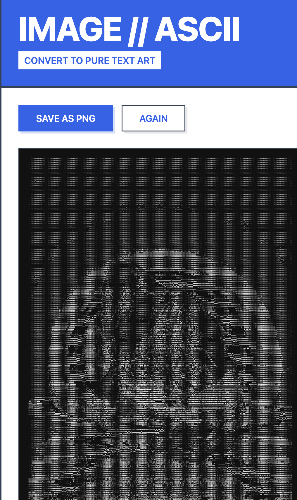
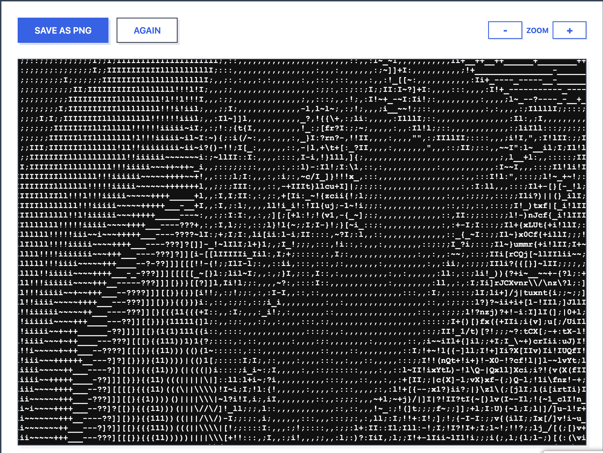
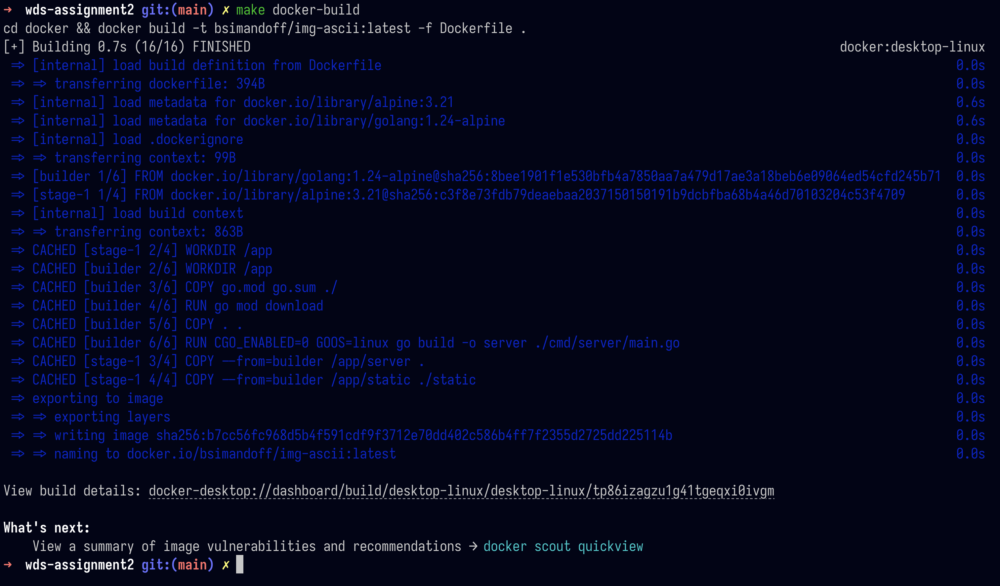
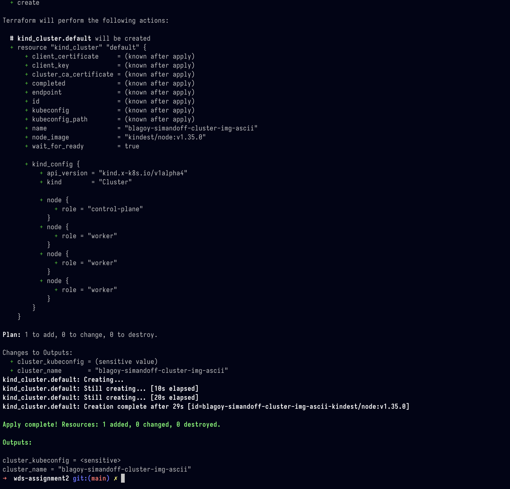
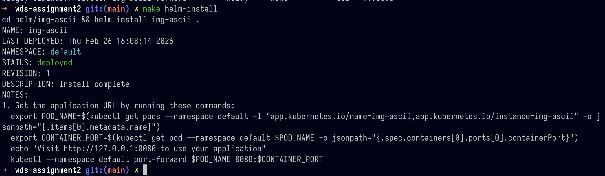

# Introduction to the web application

The web application is a simple image to ASCII-ART converter.

<div style="display: flex; gap: 30px">
    
    
</div>

Zooming in on the web preview will allow you to see the individual characters of the image.



## How does it work?

It takes an image and converts it to ASCII-ART by going through each individual pixel, getting its RGB value (255,255,255) and first converting it to a grayscale value between 0–255 by taking the weighted average of the RGB values.

Why do we use a "weighted average" instead of just taking the average of the RGB values? Human eyes are more sensitive to green than red or blue. This is called the Luminosity method. For more info: https://www.johndcook.com/blog/2009/08/24/algorithms-convert-color-grayscale/

Then we use a hardcoded array with the ASCII-ART characters ordered by their "thickness" (the thicker it is the "whiter" the character will appear) and for each grayscale value we find the corresponding character index by normalising the 0–255 value to the range of the array.

```go
strings.Split("`^\",:;Il!i~+\_-?][}{1)(|\\/tfjrxnu
    vczXYUJCLQ0OZmwqpdbkhao\*#MW&8%B@$", "")
```

## The Tech Used

This is a Golang web application with a static serve of `index.html`. It follows the conventional Golang project structure with a `cmd/` folder holding all the executables and the `internal/` folder holding all the packages that are not part of the public API. Since the project is small we do not need any of the other conventional folders such as `pkg/`, `vendor/`, etc.

# Deployment and the overall workflow

During the development of the deployment workflow the main tool used was `make`. Make and its "phony" targets were used as "local aliases" for Helm, Terraform, Docker and kubectl commands. This significantly simplified the development and made it easier to rerun commands. Using Make this way also gives you a "mini CLI" for your project. This is especially true when adding the `make help` target which uses `grep` and `sed` to generate a list of all available commands and their descriptions by parsing the Makefile and its doc comments. Doc comments can be defined via `##@` or `##` and are used to document the targets. This approach was highly inspired by this GitHub thread: [https://gist.github.com/prwhite/8168133](https://gist.github.com/prwhite/8168133)

## Overall workflow

The deployment pipeline follows a three-stage process: **containerise, provision, deploy**.

**1. Write the Dockerfile**

The application uses a multi-stage Docker build to keep the final image small.
The first stage uses `golang:1.24-alpine` to compile the binary, and the second stage copies just the compiled server and static files into a minimal `alpine:3.21` image.
One key detail is `CGO_ENABLED=0` — CGO is Go's mechanism for calling C code from Go, and it's enabled by default.
Disabling it produces a fully statically linked binary.
This avoids issues I've run into before where Go applications work fine locally but fail when deployed because the target container is missing the C libraries the binary was dynamically linked against.

This is also a good practice used by Google: https://github.com/GoogleContainerTools/distroless?tab=readme-ov-file#examples-with-docker

**2. Build and push the Docker image**

First, the application is packaged into a Docker container. Running `make docker-build` builds the image from the Dockerfile located in the `docker/` directory, tagging it as `bsimandoff/img-ascii:latest`. Once built, `make docker-push` pushes it to Docker Hub so the Kubernetes cluster can pull it later.

NOTE: when running locally you should change the `DOCKER_REPO` variable in the Makefile to your Docker Hub username.

Equivalent commands:

```bash
cd docker && docker build -t <DOCKER_REPO>/img-ascii:latest .
docker push <DOCKER_REPO>/img-ascii:latest
```



**3. Provision the Kubernetes cluster with Terraform**

Next, `make tf-apply` runs `terraform apply` against the configuration in the `terraform/` directory. This provisions a local KinD cluster.
`make tf-plan` previews changes before applying, and `make tf-destroy` tears everything down when needed.

Equivalent commands:

```bash
cd terraform && terraform apply -auto-approve
cd terraform && terraform plan
cd terraform && terraform destroy -auto-approve
```




**4. Deploy the application with Helm**

With the cluster running, `make helm-install` installs the Helm chart from `helm/img-ascii/`, which creates the necessary Kubernetes Deployment and Service resources. For subsequent updates, `make helm-upgrade` performs a rolling upgrade. Once deployed, `make helm-forward` port-forwards the service to `localhost:8080`, making the application accessible in the browser.

Equivalent commands:

```bash
cd helm/img-ascii && helm install img-ascii .
cd helm/img-ascii && helm upgrade img-ascii .
kubectl port-forward svc/img-ascii 8080:8080
```




**Convenience targets**

The Makefile also provides combined targets: `make deploy` runs both Terraform apply and Helm upgrade in sequence, while `make destroy-all` tears down the Helm release and the Terraform infrastructure together. Finally, `make help` parses the Makefile's doc comments (defined with `##@` and `##`) to generate a readable list of all available commands.

# Personal reflections

This project was my first time using Helm to create my own Helm package, having previously always written raw Kubernetes YAML manifests or just used Helm to deploy preexisting charts. Helm simplified the configuration and starting up of the server, especially with the `helm create` command which allowed me to get a quick start on a new project.
It felt a lot like running `bun create` or `npx create-next-app`.
A single command that scaffolds everything you need - but for Kubernetes.

Using Terraform for local infrastructure was also new. I've used it before for cloud providers like AWS and GCS, and even SaaS providers like Stripe, but never for local infrastructure.
Applying it to a KinD cluster really brought the configuration-as-code idea to life.
It's definitely the way I will be provisioning any future local Kubernetes clusters, especially as this allows me to rerun the whole flow in a newly deployed environment like a VPS.
